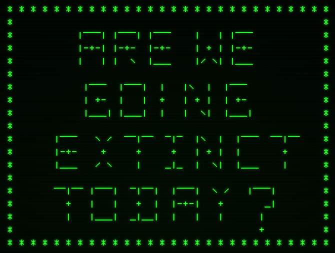

# Are We Going Extinct Today?

AWGET is a text adventure browser-based video game. 

***Are We Going Extinct Today?*** was developed using JavaScript as part of the [Ironhack](https://www.ironhack.com/) developer bootcamp (WebDev-FT-092020) using the [NeoWs (Near Earth Object Web Service)](https://data.nasa.gov/Space-Science/Asteroids-NeoWs-API/73uw-d9i8) API.

## Minimum Viable Product

The __MVP__ will cover the following:

- __Homepage:__ The homepage will present the user login.
- __Signup:__ A registration form for new users.
- __Login:__ A sign in form for existing users.
- __AWGET:__ A user will be able to play the game.

## Backlog ##

- Finish game story.
- Add new features.
- Add user database so players can save the game state.

## Data Structure ##
- **root/**
     - awget.html
     - index.html
     - signup.html
     - **css/**
          - form.css
          - styles.css
          - **fonts/**
               - font.ttf
     - **img/**
          - cover.png
     - **scripts/**
          - apiCall.js
          - awget.js
          - awget-disk.js
          - database.js
          - login.js
          - signup.js
          - users.js
          - validator.js
     - **assets/**
          - img/
          - fonts/

## Links

### Trello
[Trello Kanban board](https://trello.com/b/inwzBvjc/m1-proyecto-1)

### Git
[Gihub Repo URL](https://github.com/oooscaaar/ironhack-web-app/)

### NeoWs (Near Earth Object Web Service) by NASA
[API Description & Documentation](https://data.nasa.gov/Space-Science/Asteroids-NeoWs-API/73uw-d9i8)